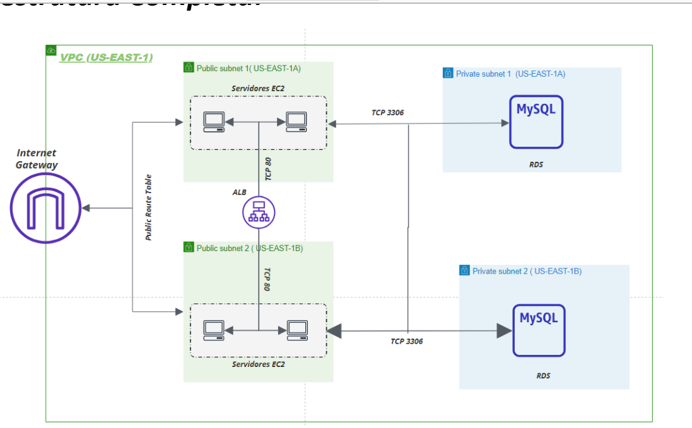

# AWS Project Documentation

---

## VPC

- **Region and CIDR**  
  The VPC is located in the `us-east-1` region due to its lower cost and is set up with the `10.0.0.0/16` network. This CIDR block provides:
  - Up to 65,534 usable IP addresses.
  - Flexibility to create multiple subnets.
  - Future scalability if more IP addresses are needed.

- **Subnets**  
  Four subnets were created:
  1. Public: `10.0.1.0/24` (us-east-1a)
  2. Public: `10.0.2.0/24` (us-east-1b)
  3. Private: `10.0.3.0/24` (us-east-1a)
  4. Private: `10.0.4.0/24` (us-east-1b)

  Each subnet provides 254 available IP addresses. The use of two availability zones (us-east-1a and us-east-1b) ensures redundancy and high availability.

- **Routing**  
  - The public subnets are connected to an Internet Gateway through a dedicated Route Table. This allows:
    - Outbound traffic from the public subnets to the internet.
    - Inbound traffic from the internet to the public subnets.
  - The private subnets do **not** have direct internet access; however, they can communicate with the public subnets (for instance, the private database needs to exchange data with the application servers in the public subnets).

- **Inter-Subnet Communication**  
  By default, AWS allows communication between subnets within the same VPC. This default was maintained to enable the private database to interact with servers hosted in the public subnets.

---

## Application Load Balancer (ALB)

- **Role of the ALB**  
  The Application Load Balancer directs incoming requests from the internet to the available application endpoints. It balances traffic across multiple servers, enhancing performance and availability.

- **Deployment**  
  - The ALB has a **public IP address** and is deployed in both public subnets (`us-east-1a` and `us-east-1b`).  
  - This multi-subnet setup ensures redundancy. If one Availability Zone (AZ) faces an issue, the ALB will continue directing traffic to healthy endpoints in the other AZ.

- **Security Group**  
  - Allows inbound HTTP (port 80) from anywhere (both inside and outside the VPC).
  - Permits outbound traffic on **any port and protocol**.

- **Target Group and Health Checks**  
  - The ALB forwards traffic to a **Target Group**, which, in this case, consists of EC2 instances.
  - A health check system sends local requests to every server every 30 seconds.  
    - Instances start in a “Unhealthy” state and only transition to “Healthy” after **two consecutive successful checks**.  
    - Only healthy servers receive traffic from the ALB.

- **Listener**  
  - A **Listener** on port 80 (HTTP) has an action type of `forward`, which routes all incoming traffic to the Target Group.

---

## EC2 Instances

- **SSH Keys**  
  - Dedicated SSH keys are created for the EC2 instances.
  - The private key is securely stored in the local project directory.

- **Launch Template**  
  - Uses an **Ubuntu** base image.
  - Runs scripts on startup to automatically launch the application.
  - Assigns a specific IAM profile to each instance, allowing them to interact with Amazon S3 (for logs, for example).

- **Security Group**  
  - Inbound HTTP (port 80) is allowed **only** from the ALB’s security group. This prevents unauthorized direct access to the servers.
  - SSH (port 22) is open to any user with the private key, providing debugging capability when necessary.
  - Outbound traffic is allowed on any port and protocol.

- **Auto Scaling Group (ASG)**
  - Configured with minimum, desired, and maximum instance counts: **2**, **4**, and **8**, respectively.
  - Monitors instance health to verify successful creation.
  - Launches instances **exclusively** in public subnets, allowing direct SSH maintenance when needed.
  - Attached to the ALB’s Target Group.

---

## CloudWatch

- **Alarms and Scaling Policies**  
  - **Alarm 1**: Triggers when CPU usage exceeds 70%, causing a **Scale Up** action.  
  - **Alarm 2**: Triggers when CPU usage drops below 20%, causing a **Scale Down** action.  
  - **Alarm 3**: Triggers when the ALB receives more than 250 requests over five minutes, causing a **Scale Up** action.  
  - **Alarm 4**: Triggers when the ALB receives fewer than 175 requests over five minutes, causing a **Scale Down** action.  

- **Policies**  
  1. **Scale Up** policy.
  2. **Scale Down** policy.
  3. A policy that can handle both Scale Up and Scale Down.

---

## IAM

- **Purpose**  
  AWS Identity and Access Management (IAM) manages identities, permissions, and access for AWS resources. In this project, it is used to:
  - Provide credentials and permissions to the EC2 instances.
  - Allow instances to upload logs to an S3 bucket.

- **Implementation**  
  1. **Role**: Created exclusively for the servers to assume.  
  2. **Policy**: Grants access to the S3 bucket.
  3. **Instance Profile**: Attached to the role and applied during EC2 launch, so the instances use these credentials automatically.

---

## RDS

- **Database**  
  - MySQL **8.0** with 5 GB storage.
  - Deployed in the **private subnets** for security reasons.
  - Configured as **Multi-AZ**: the database is replicated in a different Availability Zone within the same region. This ensures automatic failover in case the primary AZ has an outage.

- **Maintenance Window**  
  - Occurs **Monday from 00:00 to 03:00** (low user traffic).  
  - AWS can perform maintenance tasks to maintain database integrity and performance.

- **Backups**  
  - Daily backups occur from **04:00 to 07:00** (another low-traffic period).
  - The backup retention period is **7 days**.

- **Security Group**  
  - Only **port 3306** (MySQL) is open, and only for the servers’ security group.
  - Outbound traffic is allowed on any port and protocol.

---

## API

- **Technology Stack**  
  - Built in Python using **FastAPI** and **SQLAlchemy**.
  - The API receives and stores quotes (short text phrases).

- **Database Model**  
  - Has a single table with:
    - **ID**: Numeric identifier for each quote.
    - **Quote**: Phrase text, up to 50 characters.

- **Routes**  
  1. **GET** `/`: Returns “Hello World”.
  2. **GET** `/quotes/`: Returns a list of all quotes in the database.
  3. **POST** `/quotes/`: Adds a new quote to the database.
  4. **GET** `/quotes/{ID}`: Retrieves the quote matching the given ID.
  5. **PUT** `/quotes/{ID}`: Updates the quote with the specified ID.
  6. **DELETE** `/quotes/{ID}`: Deletes the quote with the specified ID.

---

## S3

- **Bucket Usage**  
  - Used for two main purposes:
    1. **Terraform State**: Stores the Terraform state file in a dedicated `tf-states` folder (with locking enabled).
    2. **Server Logs**: Logs are saved in a `logs` folder.

- **Server Logs**  
  - Each server has a file named `log_{id}`, where `{id}` is the EC2 instance identifier.
  - Each log entry records:
    - The request type (`GET`, `POST`, `PUT`, `DELETE`).
    - The route (e.g., `/quotes/`, `/`).
    - The time the request was made, e.g., `GET / 16:07:43`.

---

## Complete Infrastructure

Below is an overview of the complete network infrastructure:

1. The ALB is deployed in both public subnets, each associated with the **Public Route Table**.  
2. When a request arrives via the public IP (ALB), traffic is distributed to the servers in the public subnets.  
3. The application servers can communicate with the RDS instance in the private subnets (in either of the two Availability Zones).  
4. Nothing prevents instances from communicating with the RDS even if they are in different sub-regions (AZs).  

This setup ensures:
- High availability (redundancy across two AZs).
- Scalable compute resources (Auto Scaling Group).
- Secure private database with Multi-AZ failover.
- Organized logging in S3.
- Infrastructure as code with Terraform storing its state in the S3 bucket.

---
## Execution Instructions

1. **Configure AWS Credentials**  
   First, ensure your AWS credentials are set up via the AWS CLI. This is required for Terraform and the application to interact with AWS resources.

2. **Create the S3 Bucket (If Necessary)**  
   If an S3 bucket named **pedropmc-bucket** does not already exist, create it manually. This exact bucket name is hardcoded in both the API and the Terraform configuration files.  
   - Because S3 bucket names are globally unique, make sure no one else is creating a bucket with the same name at the same time to avoid conflicts.

3. **Working Around Name Conflicts**  
   If multiple people need to test the infrastructure with the same bucket name, there are two possible approaches:
   1. **Create and Delete**  
      Each person creates the bucket for their test, then deletes it when finished to allow someone else to reuse the same name later.
   2. **Fork and Modify**  
      - Fork the API repository, update the bucket name (found on line 16 in `app/main.py`) to a different, unique name.  
      - In the Cloud project, change the repository reference in `modules/ec2/ec2.tf` under `user_data` to point to the forked repo.  
      - Update line 11 of `main.tf` with the new bucket name.

4. **Logs Availability**  
   Even if you skip creating the bucket with the exact name, the application will still run. However, logs will not be saved, and you’ll need to adjust the bucket name accordingly in `main.tf`.

---
